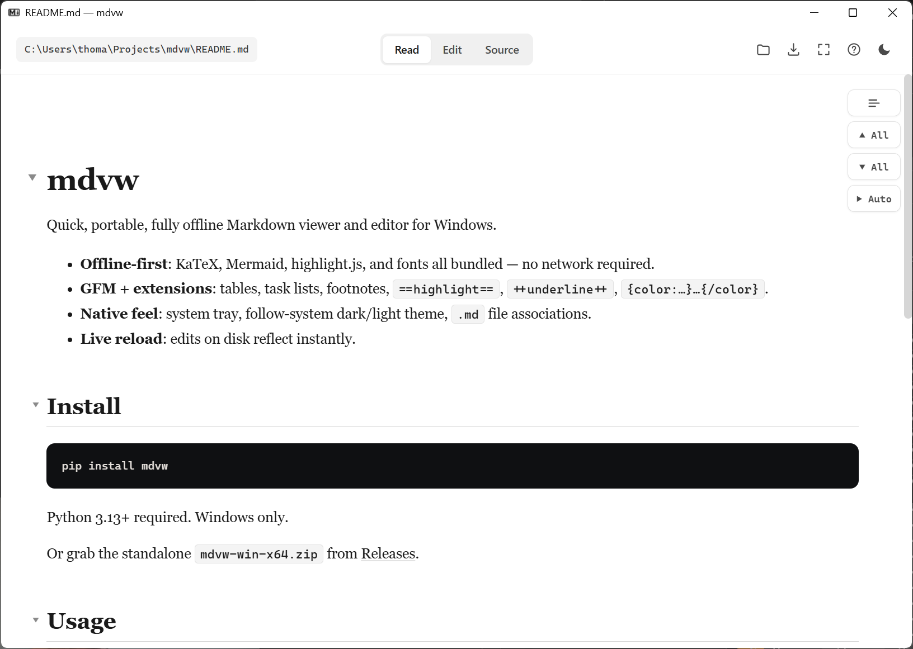
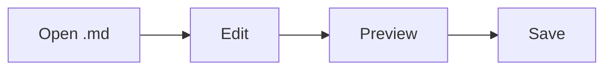

<div align="center">

# mdvw

**Fast, portable, fully offline Markdown viewer and editor for Windows.**

[](https://pypi.org/project/mdvw/)
[](https://pypi.org/project/mdvw/)
[](https://github.com/ThomasRohde/mdvw/actions/workflows/ci.yml)
[](LICENSE)

<p>
  
</p>

</div>

---

## What it is

A small Windows desktop app that opens a `.md` file and renders it beautifully — with KaTeX math, Mermaid diagrams, syntax-highlighted code, live reload when the file changes on disk, and a three-mode Read / Edit / Source view. Everything needed to render is vendored into the package: no network request is made to open or view a document.

## Why

Most Markdown viewers either need a browser tab, a heavy IDE, or pull fonts and scripts from a CDN at render time. `mdvw` is a single `pip install` away, opens fast, works without internet, and treats the document as untrusted — a hostile `.md` file can't fetch remote resources, navigate the native bridge, or overwrite your file without a conflict prompt.

## Features

- **Three modes** — Read, Edit (live split), Source (raw `.md` in a dark editor). Switch with `Ctrl+1/2/3` or cycle with `E`.
- **Offline first** — KaTeX (math), Mermaid (diagrams), highlight.js (20 languages), and webfonts all ship inside the wheel, SHA256-pinned via a manifest.
- **GFM + extensions** — tables, task lists, footnotes, strikethrough. Plus `==highlight==`, `++underline++`, and `{color:red}…{/color}` / `{color:#hex}…{/color}`.
- **Live reload** — external changes on disk re-render instantly; unsaved edits get a conflict prompt rather than being silently overwritten.
- **Outline drawer + collapsible sections** — navigate by heading or collapse sections with `▲ All` / `▼ All` / `▶ Auto`.
- **Native feel** — system tray, follow-system dark/light theme, taskbar icon (M↓), `.md` file association via `mdvw --register`.
- **Hardened** — 7 rounds of adversarial review before 0.1.0 (atomic saves, conflict detection, `<script>` breakout defense, remote-image blocking, etc. — see [SECURITY.md](#security) if you're curious).

## Install

```bash
pip install mdvw
```

Requires Python **3.13+**, Windows 10/11.

Or grab the standalone onedir build from the [Releases page](https://github.com/ThomasRohde/mdvw/releases/latest) — unzip `mdvw-win-x64.zip` and run `mdvw.exe`. No Python needed.

## Usage

```bash
mdvw notes.md              # open a file
mdvw                       # open with the bundled welcome doc
mdvw --edit notes.md       # start in split-edit mode
mdvw --no-tray             # skip the system tray icon
mdvw --register            # associate .md with mdvw (HKCU, no admin)
mdvw --unregister          # remove the association
```

### Keyboard shortcuts

| Key | Action |
|---|---|
| `Ctrl+1` / `Ctrl+2` / `Ctrl+3` | Read / Edit (split) / Source |
| `E` | Cycle Read → Edit → Source |
| `Ctrl+O` | Open file |
| `Ctrl+S` | Save (atomic; prompts on disk conflict) |
| `Ctrl+Shift+W` | Toggle narrow / wide preview |

## Markdown extensions

Beyond GitHub Flavored Markdown, `mdvw` understands:

```markdown
==highlighted== text
++underlined++ text
{color:orange}orange{/color}, {color:#bf3989}pink{/color}
```

Inline math `$e^{i\pi}+1=0$` and block math:

```markdown
$$
x = \frac{-b \pm \sqrt{b^2 - 4ac}}{2a}
$$
```

Mermaid diagrams:

````markdown

````

## Security

`mdvw` treats every `.md` file as untrusted input. A hostile document cannot:

- Break out of the JSON `<script>` bootstrap (all `<`/`>`/`&` escaped as `\uXXXX`)
- Shadow bootstrap DOM ids (user `id` attributes stripped by the sanitizer)
- Fetch remote resources — ``, protocol-relative `//…`, and UNC `\\server` refs all dropped
- Navigate the WebView to a different page (all link clicks routed to the OS shell; `js_api` bridge stays isolated)
- ShellExecute a local program — `file:` links rejected at both sanitizer and shell-open layers
- Silently overwrite your on-disk edits — `save_file` checks the file's mtime/size fingerprint against what was loaded and prompts if it changed

Saves are atomic (`tempfile` + `fsync` + `os.replace`). Vendored JS/CSS is SHA256-verified at build time; the release workflow refuses to build if a vendor byte changed.

## How it works (one paragraph)

`render.py` parses Markdown with `markdown-it-py` + plugins, sanitizes with `nh3` (Rust ammonia), and rewrites user-relative URLs against the document's own directory. `app.py` renders a template into a per-instance HTML in `%TEMP%`, references packaged JS/CSS via absolute `file://` URLs (no `<base>` — that would misdirect user links), and opens it in a pywebview window using Windows WebView2. KaTeX / Mermaid / highlight.js run in the browser post-inject.

## Releasing

The project uses a single-commit + tag pattern so the PyPI artifact's source matches the tag byte-for-byte:

```bash
# 1. Write notes under `## [Unreleased]` in CHANGELOG.md, commit
# 2. Cut the release (atomic bump + changelog date + commit + tag):
python scripts/release.py 0.2.0
git push origin main v0.2.0      # triggers release.yml → PyPI + GH Release

# 3. Open the next dev cycle:
python scripts/release.py --post-release 0.3.0.dev0
git push origin main
```

## Development

```bash
git clone https://github.com/ThomasRohde/mdvw && cd mdvw
pip install -e .[dev]
python scripts/fetch_vendor.py --verify   # make sure vendor hashes match
pytest -q                                  # run tests
ruff check src tests scripts               # lint
python -m mdvw README.md                   # try it
```

To upgrade a vendored library: `python scripts/fetch_vendor.py --update`, then commit the refreshed files and `manifest.json` together.

## License

[MIT](LICENSE). The bundled third-party assets keep their own licenses (KaTeX: MIT; Mermaid: MIT; highlight.js: BSD-3).
